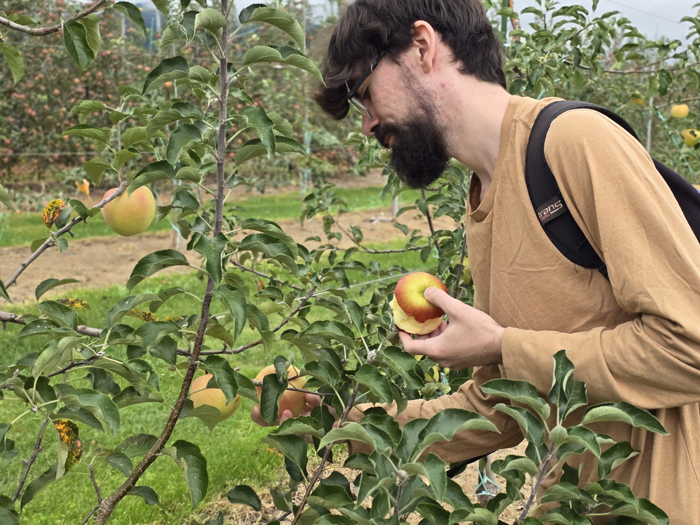

# Nole Stites' Resume
✉️ [nole.stites@gmail.com](nole.stites@gmail.com) 
📍 Tomball, TX, USA 
🔗 Website: [nolestites.com](http://nolestites.com) 
🔗 [LinkedIn](https://www.linkedin.com/in/nole-stites/) 
🔗 [GitHub](https://github.com/NoleStites/) 

# About Me
I graduated with a B.S. in Computer Science from [Southern Oregon University](https://sou.edu/) in March 2025.

I have a passion for education and have created a web application called [Graph Creator](https://nolestites.com/GraphCreator) to help students and faculty with their work.

I am research-focused, having always been curious about many things in life. I work to understand why things are the way they are or how to improve them. An instance of this is my funded [Quantum Computing Research](https://github.com/NoleStites/STEM-REx).

I reside in [Houston, TX](https://en.wikipedia.org/wiki/Houston) with my two sweet dogs Kashyyyk and Weasley. 

# Education
**Bachelor of Science in Computer Science** - <i style="color:green;font-weight:bold;">Southern Oregon University</i> 
GRADUATION DATE: MARCH 2025 • ASHLAND, OREGON • 3.9 GPA
- Member of Computer Science Club
  - 2023 Hackathon: Won 3rd place for [Shakespeare Mad Libs project](https://github.com/NoleStites/souhackathon2023)
  - Volunteer for SMILE event: taught K-5 students how to program in Scratch
- Relevant Coursework: Calculus, Cloud Computing, Linear Algebra, Theory of Computation

**Studies in the Japanese Language** - <i style="color:green;font-weight:bold;">Shinshu University</i> 
DATE: SEPTEMBER 2024 - FEBRUARY 2025 • MATSUMOTO, NAGANO, JAPAN

# Experience
**SGX3 Coding Institute**
JUNE 2024 • REMOTE
- A [workshop](https://sciencegateways.org/coding_institute) that covers the core skills needed for the design and maintenance of science gateways
- Participated in the SGX3 HackHPC hackathon, the goal of which was to make a science gateway with Python and Django, on [team NLC^2](https://hackhpc.github.io/sgx3admi24/teams.html#:~:text=Team%20Introduction-,NLC2,-%F0%9F%8F%86%20Best%20Team) (a 4-person team) and won the Judges Award ([GitHub](https://github.com/ChristianJohnsonL/SGX3-Hackathon-Project-2024))
- Hackathon poster project presented at Science Gateways 2024 Annual Conference

**Computer Science Tutor** - <i style="color:green;font-weight:bold;">Southern Oregon University</i> 
APRIL 2023 - JUNE 2024 • ASHLAND, OREGON
- Tutor college computer science courses at levels ranging from beginner Python and C++ to advanced topics, communicating technical information at a variety of levels of understanding
- Create resources and thorough documentation for students and admin use

**Lab and Classroom Support Analyst** - <i style="color:green;font-weight:bold;">Southern Oregon University</i> 
APRIL 2023 - AUGUST 2024 • ASHLAND, OREGON
- Resolve technical difficulties with campus technologies for professors and students
- Install software and hardware and reimage machines in labs and classrooms throughout campus

# Projects
**Web App: Graph Creator**
- An educational web app made by myself for students and faculty to easily create node-edge-based graphs and simulate algorithms on those graphs. View the live app [here](http://nolestites.com/GraphCreator)
- Improved accessibility by using solid and dashed lines instead of color alone to convey information, supporting users with visual impairments
- Technologies used: HTML, CSS, JavaScript, Git/GitHub

**React Wave Function Collapse**
- React project [hosted on GitHub](https://github.com/NoleStites/Sudoku_in_React.git) that pipes the output from a Python wave collapse function into a React app
- Technologies Used: React, Python, HTML, CSS, JavaScript, Git

**Quantum Computing Introductory Lecture** - <i style="color:green;font-weight:bold;">STEM REx</i> 
- Partook in funded research to create an introductory lecture for quantum computing
- Consolidated complex technical material into a slide deck highlighting key points of quantum computing, all of which is [hosted on GitHub](https://github.com/NoleStites/STEM-REx.git)

**Flow Cytometry Analysis Automation** - <i style="color:green;font-weight:bold;">BD Biosciences</i> 
- Develop an automated cell-identification algorithm in Python and Java for use by bioinformatic researchers
- Collaborating with a teammate, planned project and created documentation using agile development practices
- Technologies Used: Python, Git, Machine Learning (ML), Agile Methodologies

**Sudoku Wave Function Collapse**
- Python project [hosted on GitHub](https://github.com/NoleStites/Sudoku-Wave-Collapse-Function) that generates sudoku boards using wave function collapse
- Use object-oriented design patterns to optimize functionality and efficiency

**Trading Company Datanase**
- Designed and implemented a relational database in MySQL and accompanying frontend interface in PHP
- Use stored procedures, functions, and triggers to enforce data integrity and user-friendliness

# Certifications
**[Wells Fargo Software Engineering Job Simulation](https://forage-uploads-prod.s3.amazonaws.com/completion-certificates/nkmk7gJitYs4TBvoA/9Wvq4L2WCFQDyyPp3_nkmk7gJitYs4TBvoA_67e20116704544495eefb81c_1744421822488_completion_certificate.pdf) on Forage - April 2025**
- Understood relevant requirements for building a system to manage financial portfolios
- Figured out what data the system needed to keep track of
- Drafted a visual representation of the data as an entity relationship diagram (ERD)
- Used the IntelliJ developer application to implement the ERD and published it to [GitHub](https://github.com/NoleStites/wells-fargo-task-2.git)
- Check out the simulation here: https://www.theforage.com/simulations/wells-fargo/software-engineering-nkq4

# Skills
- Databases (Data Modeling, ERD Design, MySQL, MongoDB, and RESTful APIs to connect to them)
- Software Engineering (C++, HTML/CSS, JavaScript, Python, Java/JPA/Spring)
- Cloud Computing (Google Cloud Platform, Microsoft Azure)
- Mathematics (calculus, differential equations, discrete structures, linear algebra)
- Technical Communication
- Elementary Japanese

